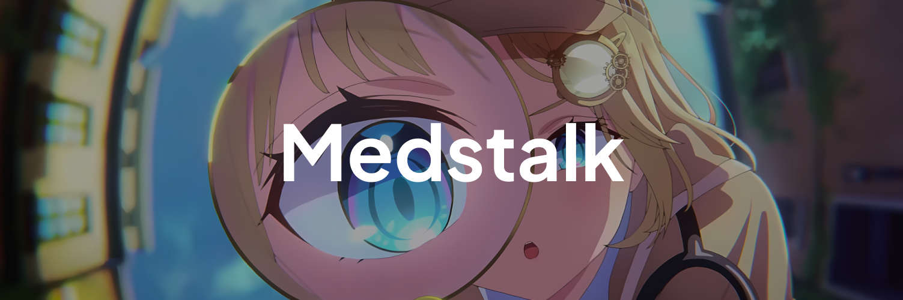

# Medstalk, a simple information gathering website! ✨



## Description

Medstalk (Media Stalk) is a website that is useful for gathering information and data on the target account. Medstalk can be used for analytics purposes.

## Features

Medstalk can gather informations from available platform, such as:

* [X] Youtube
* [X] TikTok (Under maintenance)
* [X] Instagram (in development)
* [X] Facebook (in development)

## Tech Stack

Medstalk is built using tech stacks such as NextJS, ReactJS, TailwindCSS and RapidAPI.

## Getting Started

First, run the development server:

```bash
npm run dev
# or
yarn dev
# or
pnpm dev
# or
bun dev
```

Open [http://localhost:3000](http://localhost:3000) with your browser to see the result.

You can start editing the page by modifying `app/page.js`. The page auto-updates as you edit the file.

This project uses [`next/font`](https://nextjs.org/docs/basic-features/font-optimization) to automatically optimize and load Inter, a custom Google Font.

## Learn More

To learn more about Next.js, take a look at the following resources:

- [Next.js Documentation](https://nextjs.org/docs) - learn about Next.js features and API.
- [Learn Next.js](https://nextjs.org/learn) - an interactive Next.js tutorial.

You can check out [the Next.js GitHub repository](https://github.com/vercel/next.js/) - your feedback and contributions are welcome!

## Deploy on Vercel

The easiest way to deploy your Next.js app is to use the [Vercel Platform](https://vercel.com/new?utm_medium=default-template&filter=next.js&utm_source=create-next-app&utm_campaign=create-next-app-readme) from the creators of Next.js.

Check out our [Next.js deployment documentation](https://nextjs.org/docs/deployment) for more details.

## Motivation

I created this project inspired by a Japanese hololive character named Watson Amelia (ワトソン・アメリア). She is an English-speaking female Virtual YouTuber associated with hololive, debuting in 2020 as part of the first generation hololive English “-Myth-,” along with Ninomae Ina'nis, Takanashi Kiara, Mori Calliope, and Gawr Gura.

The part that reflects her being a detective is mainly in the type of clothing she wears. She wears a light brown deerstalker (commonly known as a “detective hat”) with a checkered pattern on the sides, and a golden hairpin that symbolizes a magnifying glass decorated with several gears.


